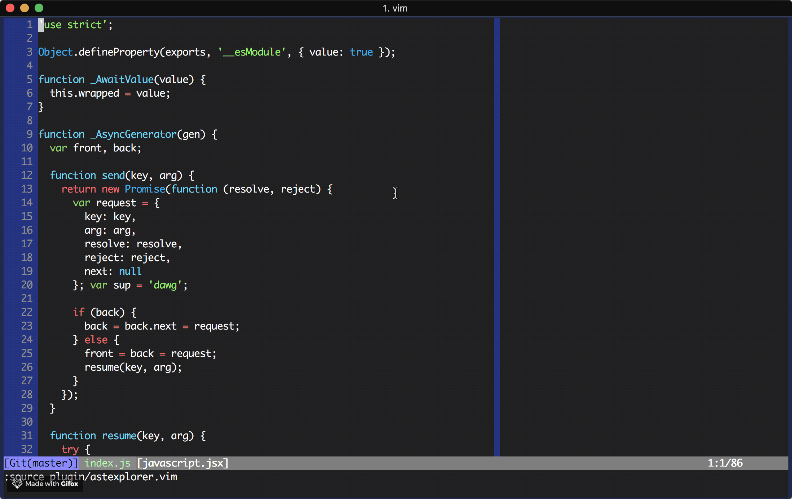

# vim-ast-explorer

[WIP] AST Explorer plugin for vim; inspired by https://astexplorer.net/.



Highly experimental so far, so don't install this plugin.

Works with:
- @babel/parser (babylon)
- esprima
- acorn

## TODO

- [x] Jump to AST node from file
- [x] Actually highlight nodes instead of using visual mode
- [x] Automatically detect available supported parsers for filetype
- [ ] Prettier AST output: folds, highlighting
- [ ] Support for more parsers and languages
- [ ] Invoke parser with async job
- [ ] Run parser on buffer contents instead of current file name
- [ ] Switch between available parsers

## Development

Set up linting:

```
pyenv virtualenv 3.6.3 $(cat .python-version)
pip install -r requirements-lock.txt
```
